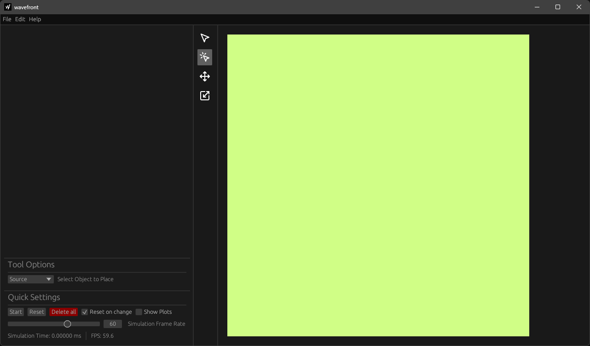

# Gettings Started

The following page only servers as a brief introduction to wavefront. Be sure to check out the rest of this user manual to understand this piece of software in its entirety.

Having either downloaded a pre-build binary or build wavefront from source you are left with a `wavefront` binary. Wavefront does not require any further installation as it is a portable software. Just double click the executable to run the program.

You should be greeted by this window:

The default tool is the [place](tools/place.md) tool  which allows you to place one of the following objects:

- [Source](objects/source.md)
- [Rectangular](objects/rect_wall.md) or [circular](objects/circ_wall.md) wall
- [Microphone](objects/microphone.md)

As show in the [tool option](ui/tool_settings.md) panel `Source` is selected meaning you'll be placing sources. Click on the [render area](./ui/render_area.md) to place a source. A new entry named `Source 0` should appear in the [outline](ui/outline.md) panel.

Press `space` or click the `Start` button to run the simulation. Press `space` again to stop.

In the [tool bar](ui/toolbar.md) select the [move](tools/move.md) tool . This tool allows you move any object contained in the render area. If you feel like experimenting try placing a wall and resizing it using the [resize](tools/resize.md) tool .

Currently the simulation is reset every time you move or change an object. To disable this behavior uncheck `Reset on change` in the [quick settings](ui/quick_settings.md) menu.

All objects can be further customized in the [outline](ui/outline.md) panel.

While the [render area](./ui/render_area.md) displays the simulation, microphones give the user a more in depth visualization of the simulation properties by displaying sound volume and frequency in the [volume](ui/plots/volume.md) and [frequency](ui/plots/frequency.md) plots. After placing a microphone enable the plots using the `Show Plots` checkbox.

Also check out our list of [keybinds](ui/keybinds.md) for more efficient use of wavefront.
