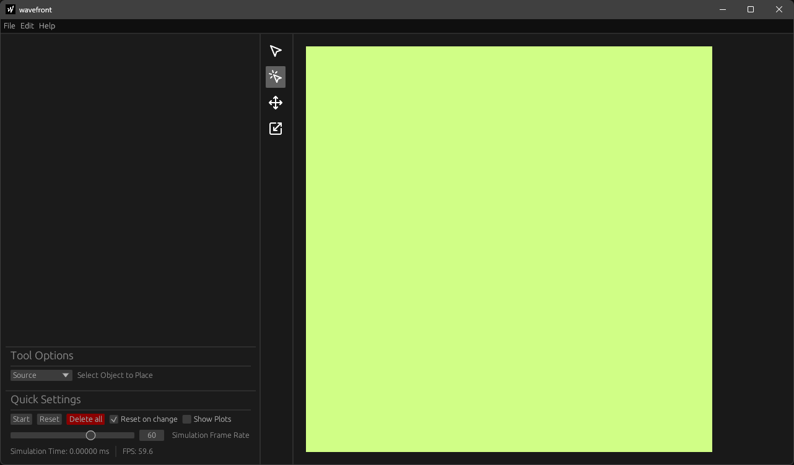
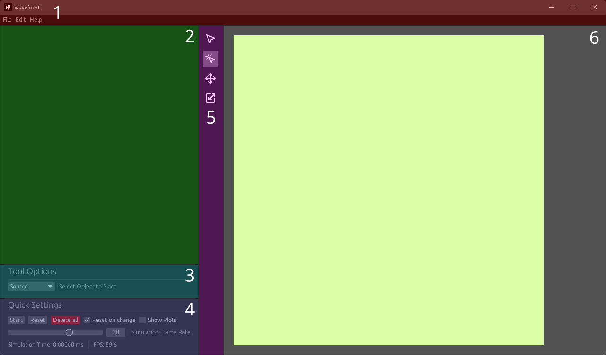
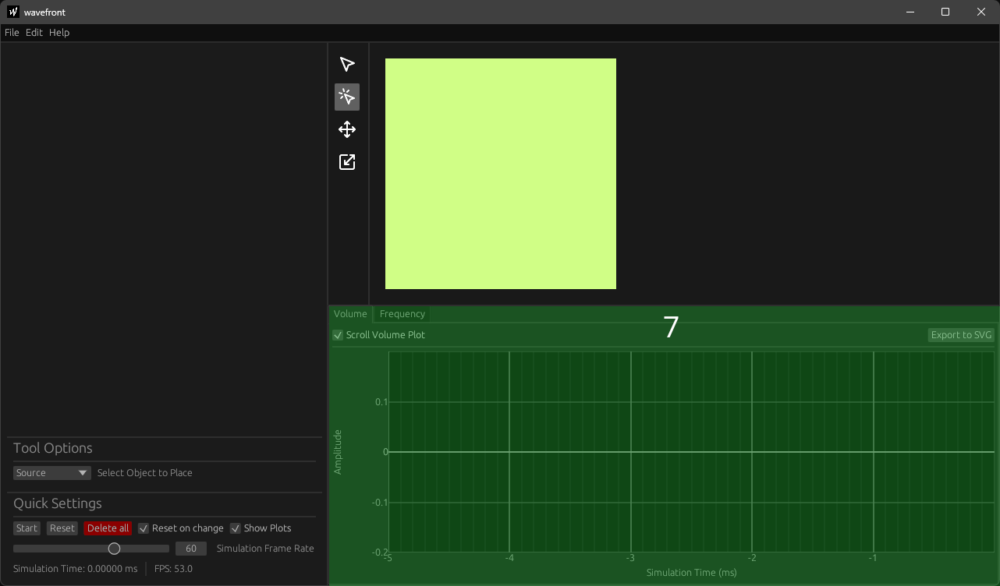

# Introduction

After starting wavefront, the opened window should look similar to the image below.

    
    

        Default wavefront startup window
    

Wavefronts interface can be separated into seven main areas. Six of those areas are visible by deafult. The image below has them counted as well as color coded:

    
    

        Wavefront screen layout
    

* [Topbar](./topbar.md) (1 & red)
    * The topbar at the very top is used to save, load and screenshot a simulation as well as to access the preferences and keybinds.
* [Outline](./outline.md) (2 & green)
    * The outline at the left lists all objects in the scene and offers more settings per object
* [Tool Settings](./tool_settings.md) (3 & lightblue)
    * The tool settings at the bottom left are used to change tool specific settings
* [Quick Settings](./quick_settings.md) (4 & lightpurple)
    * The quicksettings at the bottom left offer important settings for the overall simulation
* [Toolbar](./toolbar.md) (5 & purple)
    * The toolbar in the middle is used to select the current tool
* [Render Area](./render_area.md) (6 & white)
    * The render area on the right displays the simulation in two dimensions

## Plots

The [plot panel](../plots/volume.md) can be accessed by enabling the `Show Plots` checkbox in the quick settings. Once clicked another seventh ui area will open, as shown in the image below:

    
    

        Wavefront screen layout
    

