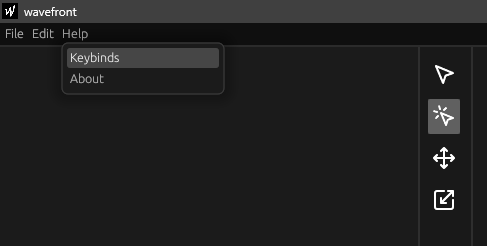

# Shortcuts

Any of the following keybinds can also be found in the keybinds window:

## File actions

| Action                   | Keybind          |
| ------------------------ | ---------------- |
| Create new simulation    | Ctrl + N         |
| Save current simulation  | Ctrl + S         |
| Open previous simulation | Ctrl + O         |
| Quit simulation          | Ctrl + Q         |

## General

| Action                   | Keybind          |
| ------------------------ | ---------------- |
| Undo                     | Ctrl + Z         |
| Redo                     | Ctrl + Shift + Z |
| Copy selected            | Ctrl + C         |
| Paste clipboard          | Ctrl + V         |

## Simulation

| Action     | Keybind |
| ---------- | ------- |
| Play/Pause | Space   |

## Tools

| Action                      | Keybind                    |
| --------------------------- | -------------------------- |
| Delete selected             | Backspace or Delete        |
| Snap to grid                | Ctrl + Move or resize wall |
| Select tool                 | Q                          |
| Move tool                   | W                          |
| Resize tool                 | E                          |
| Place rectangular wall tool | R                          |
| Place circular wall tool    | C                          |
| Place source tool           | S                          |
| Place microphone tool       | M                          |
