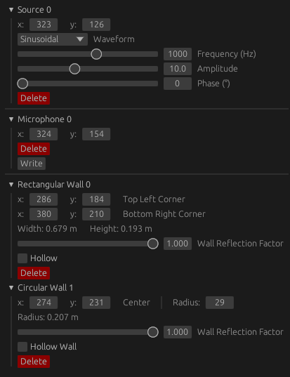

# Outline

The outline panel is used for changing object settings. The objects are grouped into three groups:

- [Sources](../objects/source.md)
- [Microphones](../objects/microphone.md)
- [Rectangular](../objects/walls.md#rectangle-walls) or [circular](../objects/walls.md#circle-walls) walls

    
    

        Outline panel with multiple objects
    

## Highlight Features

When selecting an object in the render area using the [select](../tools/select.md)  or [move](../tools/move.md)  tool, the selected object's entry in the outline panel will be expanded. All other entries will close.

When hovering over a closed entry in the outline panel, the corresponding object will be highlighted in the render area.

When expanding an entry in the outline panel, the corresponding object will be highlighted in the render area regardless of the cursor position.

## Delete

The delete button allows for the deletion of an object This can be reverted using `Ctrl + Z`.

## Object-Specific Settings

The parameters specific to each object are detailed on the respective object's page.