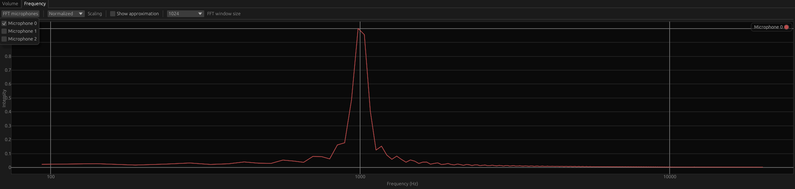

# Frequency

> This feature is currently experimental and can be enabled in the [preferences](../preferences.md).

The frequency plot panel displays the intensity of the discrete Fourier transform of a microphone signal over the frequency range of 0 to 20,000 Hz.

    
    

        Frequency plot panel
    

To generate a frequency plot, one or more microphones must be selected using the `FFT microphones` button.

The `Scaling` dropdown menu allows the user to select between `Normalized` (linear intensities ranging from 0 to 1) or `dB` scaling.

Enabling the `show approximation` checkbox applies a moving average over the frequency plot for smoothing.

The `FFT window size` dropdown menu lets the user specify the number of samples used for performing the FFT.