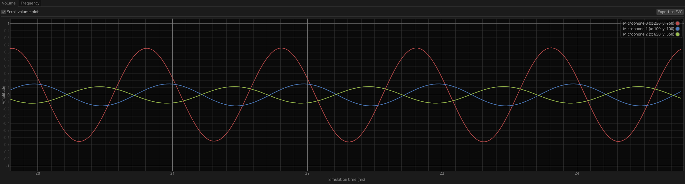

# Volume

The volume plot panel plots microphone amplitude against simulation time in milliseconds.

    
    

        Volume plot panel
    

By default, the plot window covers the last 6 milliseconds of simulation time. \
Unchecking the `Scroll volume plot` checkbox allows the user to freely move inside the plot window by using:
- `Scroll` to move vertically
- `Shift + Scroll` to move horizontally
- `Ctrl + Scroll` to zoom in and out
- `Click & Drag` to move in all directions

Microphone signals can be activated or deactivated by selecting the corresponding microphone entry in the legend located in the upper-right corner of the plot window.

The `Export to SVG` button prompts the user with a file dialog that enables the user to save the complete plot window, rather than just the most recent 6 milliseconds, in SVG file format.