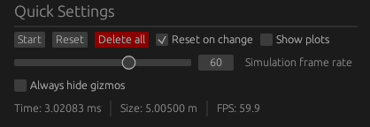

# Quick Settings

The quick settings panel offers frequently used simulation and program customization options, allowing for efficient configuration and adjustments.

    
    

        Quick settings panel
    

It is grouped into four rows:

The first row offers the `Start`/`Stop` button which is used to start or stop the simulation. \
The `Reset` button resets the simulation area and time. The simulation does not pause after the reset. \
The `Delete All` button deletes all simulation objects. It resets the simulation area, but not the simulation time. <!-- TODO: we should change that --> \
The `Reset on change` checkbox configures the behavior when simulation objects are changed. When enabled, the simulation area and time are reset every time an object's state changes. \
The `Show plots` checkbox enables the plot panel, including the [volume](./plots/volume.md) and [frequency](./plots/frequency.md) plots.

The `Simulation frame rate` slider enables users to adjust the simulation speed. If a frame rate exceeding 60 Hz is selected, an epilepsy warning must be acknowledged and accepted before proceeding.

The `Always hide gizmos` checkbox permanently disables the display of gizmos within the simulation area, regardless of the simulation's state.

The fourth row displays the simulation time in milliseconds, the height/width of the simulation area in meters and the frames per second the ui is drawn in. This does not equal the simulation frame rate. If this value drops below your monitor's refresh rate, your computer hardware cannot keep up with the current simulation frame rate.