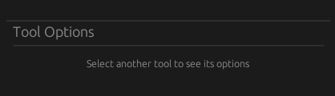
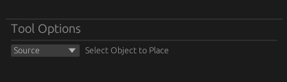
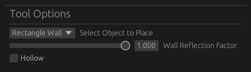

# Tool Options

The tool options panel is used for customizing a tool's behavior.

## No Tool Options

When a tool lacking configurable options is selected, the tool options panel will display an alert message. This is the case for all tools except for the [place](../tools/place.md) tool .

    
    

        Tool without tool options
    

## Place Tool

The place tool will allow you to change the object type that is to be placed. A drop-down menu will display in order:

- Source
- Microphone
- Rectangle Wall
- Circular Wall

    
    

        Tool options for source placing
    

By default, `Source` will be selected. You can also use [keybinds](./keybinds.md) to change this setting.

When selecting either `Rectangle Wall` or `Circular Wall` the tool options panel will show the `Wall reflection factor` and `Hollow` settings.

    
    

        Tool options for rectangle wall
    

